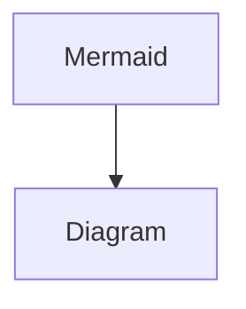

## Toggle(TODO)

通常のトグル

:::details title
content
:::

タイトルなしトグル

:::details
only content
:::

本文なしトグル

:::details only title

:::

本文に別ブロックあり

:::details some blocks
text

```javascript
console.log('hello');
```

> 引用

:::

## To Do

通常のリスト

- [ ] item1
- [x] item2

ネストしたリスト

- [ ] item1
  - [ ] nested item1
- [x] item2
  - [ ] nested item2
    - [x] nested nested item1

リスト以外のブロックを含むリスト

- [ ] item1

  > 引用A

- [ ] item2

  - [ ] nested item

    > 引用B

## Table

通常のテーブル

| header1  | header2  |
| -------- | -------- |
| content1 | content2 |
| content3 | content4 |

ヘッダーだけテーブル

| header1 | header2 |
| ------- | ------- |

リッチテキスト入りテーブル

| **bold** | _italic_          |
| -------- | ----------------- |
| color    | ~~strikethrough~~ |
| Equation | link              |

列見出し・行見出しのテーブル

| header1  | header2  |
| -------- | -------- |
| content1 | content2 |
| content3 | content4 |

## Synced block

同期元ブロック
synced block

同期先ブロック
synced block

## Quote

通常のQuote

> normal Quote

リッチテキストQuote

> color **bold** _italic_ ~~strikethrough~~ _underline_ `code` Equation link

Quote内部に別ブロック

> quote
>
> - item1
> - item2

## PDF

アップロード

外部ファイル

## Paragraph

通常のテキスト
Paragraph text

様々なアノテーション
color **bold** _italic_ ~~strikethrough~~ _underline_ `code` Equation link

1つに複数アノテーション
_***bold-italig-underline***_

リンクテキスト
https://qiita.com/konatsu_p/items/dfe199ebe3a7d2010b3e

## Numbered list item

通常のリスト

1. item1
2. item2

ネストしたリスト

1. item1
   1. nested item1
2. item2
   1. nested item2
      1. nested nested item1

リスト以外のブロックを含むリスト

1. item1

   > 引用A

2. item2

   - nested item

     > 引用B

## Link Preview(TODO)

GitHub Preview
https://github.com/salvage0707/notion-md-converter/pull/1

## Image

空画像

アップロード画像

リンク埋め込み

Unsplash

GIHPY

## Heading

# Heading 1

## Heading 2

### Heading 3

## Embed(TODO)

SpeakerDeck（IDあり）(TODO)
@[speakerdeck](7785609673f8490fbd44d3c23418ecda)

## h2 text

- list item1
- list item2

## Code Block

Plain Text

```
sample code block
```

JavaScript

```javascript
console.log('hello');
```

コードにリッチテキストあり（code, Equation, link はコードブロックでは未対応）

```javascript
console.log('color bold italic strikethrough underline');
```

キャプションあり（diffなし、ファイル名あり）(TODO)
{/* ファイル名は title="hello.js"として設定しないとmdxが認識しない MDXの方でtitle→しているから難しそう */}
{/* ```javascript:hello.js */}

```javascript title="hello.js"
console.log('diff: false, filename: true');
```

キャプションあり（diffあり、ファイル名なし）

```diff javascript
- console.log("diff: true, filename: false")
+ console.log("add code")
```

キャプションあり（diffあり、ファイル名あり）

```diff javascript:hello.js
- console.log("diff: true, filename: true")
+ console.log("add code")
```

キャプションにリッチテキストあり（codeはキャプションでは未対応）

```javascript:color bold italic strikethrough underline   Equation link
console.log("caption rich text")
```

Mermaid(TODO)



## Child page

通常の子ページ

## Callout Block

通常のCallout(TODO)

:::message
normal callout
:::

## Bulleted list item

通常のリスト

- item1
- item2

ネストしたリスト

- item1
  - nested item1
- item2
  - nested item2
    - nested nested item1

リスト以外のブロックを含むリスト

- item1

  > 引用A

- item2

  - nested item

    > 引用B

## Breadcrumb

## Bookmark

空のブックマーク
[]()

通常のブックマーク(TODO)
[https://zenn.dev/zenn/articles/markdown-guide#%E3%83%95%E3%82%A1%E3%82%A4%E3%83%AB%E5%90%8D%E3%82%92%E8%A1%A8%E7%A4%BA%E3%81%99%E3%82%8B](https://zenn.dev/zenn/articles/markdown-guide#%E3%83%95%E3%82%A1%E3%82%A4%E3%83%AB%E5%90%8D%E3%82%92%E8%A1%A8%E7%A4%BA%E3%81%99%E3%82%8B)
